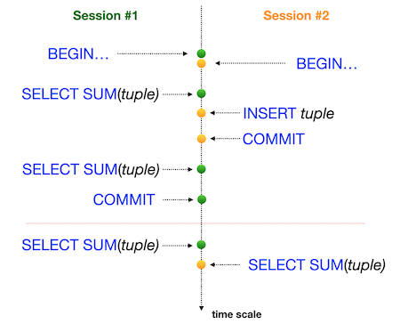

# Task0 - Простая транзакция
Пожалуйста, используйте командную строку для базы данных PostgreSQL (psql) для этой задачи. Вам необходимо проверить, как ваши изменения будут опубликованы в базе данных для других пользователей базы данных.
На самом деле нам нужны два активных сеанса (т.е. 2 параллельных сеанса в командной строке).
Предоставьте доказательство того, что ваш параллельный сеанс не сможет увидеть ваши изменения, пока вы не сделаете COMMIT;
См. шаги ниже.
Сессия №1

Обновление рейтинга «Pizza Hut» до 5 баллов в транзакционном режиме.
Проверьте, видны ли изменения в сеансе №1.

Сессия №2

Убедитесь, что вы не видите изменений в сеансе №2.

Сессия №1

Опубликуйте свои изменения для всех параллельных сеансов.

Сессия №2

Проверьте, видны ли изменения в сеансе №2.

Итак, взгляните на пример нашего вывода для сеанса №2.

    pizza_db=> select * from pizzeria where name  = 'Pizza Hut';
    id |   name    | rating
    ----+-----------+--------
    1 | Pizza Hut |    4.6
    (1 row)

    pizza_db=> select * from pizzeria where name  = 'Pizza Hut';
    id |   name    | rating
    ----+-----------+--------
    1 | Pizza Hut |      5
    (1 row)

Вы можете видеть, что один и тот же запрос возвращает разные результаты, поскольку первый запрос был выполнен до публикации в сеансе №1, а второй запрос был выполнен после завершения сеанса №1.

# Task1 - Аномалия потерянного обновления
Пожалуйста, используйте командную строку для базы данных PostgreSQL (psql) для этой задачи. Вам необходимо проверить, как ваши изменения будут опубликованы в базе данных для других пользователей базы данных.
На самом деле нам нужны два активных сеанса (т.е. 2 параллельных сеанса в командной строке).
Перед запуском задачи убедитесь, что вы находитесь на стандартном уровне изоляции в своей базе данных. Просто запустите следующий оператор SHOW TRANSACTION ISOLATION LEVEL;, и результатом должно быть "read commited".
Если нет, установите уровень изоляции read commited явно на уровне сеанса.

 

Проверьте рейтинг «Pizza Hut» в режиме транзакции для обоих сеансов, а затем измените UPDATEрейтинг на значение 4 в сеансе № 1 и измените UPDATEрейтинг на значение 3,6 в сеансе № 2 (в том же порядке, что и на рисунке).

# Task2 - Потерянное обновление для повторяющегося чтения
Пожалуйста, используйте командную строку для базы данных PostgreSQL (psql) для этой задачи. Вам необходимо проверить, как ваши изменения будут опубликованы в базе данных для других пользователей базы данных.
На самом деле нам нужны два активных сеанса (т.е. 2 параллельных сеанса в командной строке).

 

Проверьте рейтинг «Pizza Hut» в режиме транзакции для обоих сеансов, а затем измените UPDATEрейтинг на значение 4 в сеансе № 1 и измените UPDATEрейтинг на значение 3,6 в сеансе № 2 (в том же порядке, что и на рисунке).

# Task3 -  Аномалия неповторяющихся показаний
Пожалуйста, используйте командную строку для базы данных PostgreSQL (psql) для этой задачи. Вам необходимо проверить, как ваши изменения будут опубликованы в базе данных для других пользователей базы данных.
На самом деле нам нужны два активных сеанса (т.е. 2 параллельных сеанса в командной строке).

 

Проверьте рейтинг «Pizza Hut» в режиме транзакции для сеанса №1, а затем измените UPDATEрейтинг до значения 3,6 в сеансе №2 (в том же порядке, что и на рисунке).

# Task4 - Неповторяющиеся чтения для сериализации
Пожалуйста, используйте командную строку для базы данных PostgreSQL (psql) для этой задачи. Вам необходимо проверить, как ваши изменения будут опубликованы в базе данных для других пользователей базы данных.
На самом деле нам нужны два активных сеанса (т.е. 2 параллельных сеанса в командной строке).

 

Проверьте рейтинг «Pizza Hut» в режиме транзакции для сеанса №1, а затем измените UPDATEрейтинг до значения 3,0 в сеансе №2 (в том же порядке, что и на рисунке).

# Task5 - Аномалия фантомных показаний
Пожалуйста, используйте командную строку для базы данных PostgreSQL (psql) для этой задачи. Вам необходимо проверить, как ваши изменения будут опубликованы в базе данных для других пользователей базы данных.
На самом деле нам нужны два активных сеанса (т.е. 2 параллельных сеанса в командной строке).

 

Пожалуйста, суммируйте все рейтинги для всех пиццерий в одном транзакционном режиме для сеанса №1, а затем создайте INSERTновый ресторан «Казань Пицца» с рейтингом 5 и ID=10 в сеансе №2 (в том же порядке, что и на рисунке).

# Task6 - Фантомные чтения для повторяющегося чтения
Пожалуйста, используйте командную строку для базы данных PostgreSQL (psql) для этой задачи. Вам необходимо проверить, как ваши изменения будут опубликованы в базе данных для других пользователей базы данных.
На самом деле нам нужны два активных сеанса (т.е. 2 параллельных сеанса в командной строке).

 

Пожалуйста, суммируйте все рейтинги всех пиццерий в одном транзакционном режиме для сеанса №1, а затем создайте INSERTновый ресторан «Казань Пицца 2» с рейтингом 4 и ID=11 в сеансе №2 (в том же порядке, что и на рисунке).

# Task7 - Тупик
Пожалуйста, используйте командную строку для базы данных PostgreSQL (psql) для этой задачи. Вам необходимо проверить, как ваши изменения будут опубликованы в базе данных для других пользователей базы данных.
На самом деле нам нужны два активных сеанса (т.е. 2 параллельных сеанса в командной строке).
Давайте воспроизведем ситуацию взаимоблокировки в нашей базе данных.

 

Пожалуйста, напишите любой оператор SQL с любым уровнем изоляции (можно использовать настройку по умолчанию) в таблице, pizzeriaчтобы воспроизвести эту ситуацию взаимоблокировки.